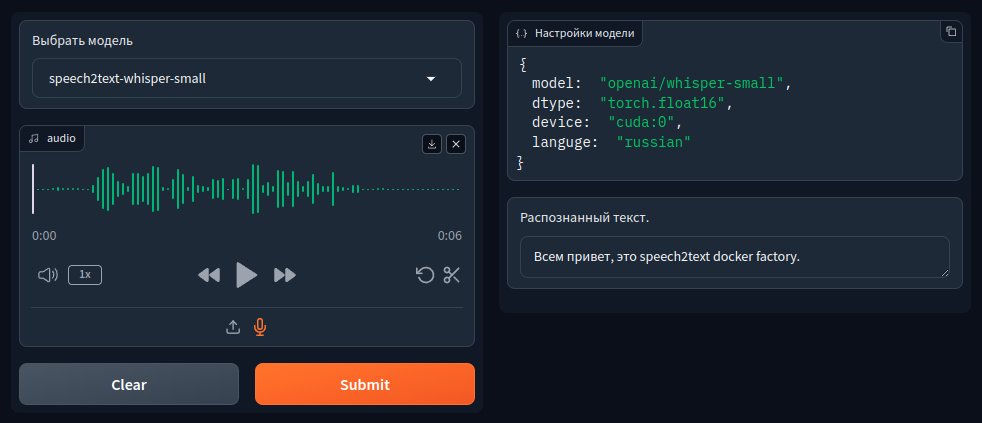
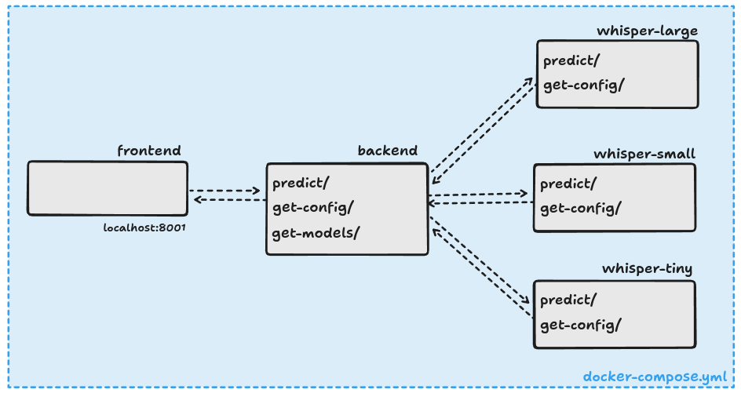

# Speech2Text Project

## Description

This project provides speech-to-text functionality using various models deployed in Docker containers. The project consists of a Backend (FastAPI) and a Frontend (Gradio).



## Project Structure

```
├── backend
│   ├── api
│   │   ├── app
│   │   │   ├── endpoint.py         # Main FastAPI endpoints
│   │   │   └── middleware.py       # Middleware for processing requests and responses
│   │   └── main.py                 # Main file to launch the FastAPI application
│   ├── dockerfile                  # Dockerfile for building the backend service image
│   ├── env.py                      # Configuration parameters and environment variables for the backend
│   ├── main.py                     # Entry point for launching the backend application
│   ├── ssl
│   │   ├── local_cert.pem          # Local SSL certificate for secure connections
│   │   └── local_key.pem           # Local SSL key for secure connections
│   └── utils
│       └── model_manager.py        # Utilities for managing and loading models
│      
├── frontend
│   ├── env.py                      # Configuration parameters and environment variables for the frontend
│   ├── gradio_app.py               # Gradio application for the user interaction interface
│   ├── main.py                     # Entry point for launching the frontend application
│   └── ssl
│       ├── local_cert.pem          # Local SSL certificate for secure connections
│       └── local_key.pem           # Local SSL key for secure connections
│   
├── LICENSE                         # Project license agreement
├── docker-compose.yml              # Docker Compose file for orchestrating backend and frontend containers
├── README.md                       # Project documentation and instructions
└── requirements.txt                # Python dependencies for installation via pip
```



## Running the Project

1. Clone the repository:
    ```bash
    git clone https://github.com/dimkablin/speech2text-docker-factory.git
    cd speech2text_project
    ```

2. Set up environment variables:
    - Create a `.env` file in both the `backend` and `frontend` directories with the necessary configuration parameters. Use the `env.py` files as a reference for the required variables.

3. Build and run the Docker containers using Docker Compose:
    ```bash
    docker-compose up --build
    ```

4. Open your browser and go to `http://localhost:8001` to use the Gradio interface.

## Endpoints

### Backend Endpoints

- **predict/**: Endpoint for making predictions using the models.
- **get-config/**: Endpoint for fetching configuration details.
- **get-models/**: Endpoint for retrieving available models.

### Frontend Endpoint

- **http://localhost:8001**: Gradio interface for user interactions.

## Additional Information

- **SSL Configuration**: Ensure that your SSL certificates (`local_cert.pem` and `local_key.pem`) are correctly placed in the `ssl` directories of both the backend and frontend.
- **Model Management**: The backend uses `model_manager.py` to handle model loading and management. Ensure models are correctly configured and available.

## License

This project is licensed under the terms of the [LICENSE](LICENSE) file.
